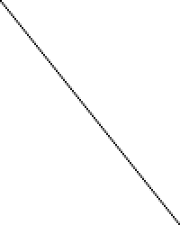

# 插值技术

本文将涵盖一些标准的视频帧时域插值(temporal interpolation)技术，尤其概述了SVP/MVtools（也称为基于运动的插值）等技术和诸如smoothmotion等算法之间的差异。你还可以在[该资源库](https://github.com/haasn/interpolation-samples)中找到一组专门用于复制这些算法结果的测试片段，以及一些更多的解释。

为了演示差异，尝试当在60Hz的显示器上显示一个24Hz的视频文件时，我们将查看会发生什么。这就是我将使用的源文件。为了便于描述，每个视频帧将显示为图像的一条水平线。（因此纵轴是时间轴）

我们现将探讨将其转换为60Hz视频流的不同技术（例如，适应在60Hz显示器上显示）。因此，纵轴将从100像素重新缩放到250像素。（60/24=2.5）

## 3:2下拉(pulldown)

传统的技术，包括mpv的默认行为，是简单地保持源的每个帧，直到经过下一帧的相应时间戳。由于这个示例中的特殊比例（60/24=2.5），这表示第一帧将被显示3次，第二帧2次，第三帧3次，第四帧2次，以此类推。这个模式看起来像这样：

    A A A B B C C C D D E E E F F

可以清楚地观察到，不一致的宽度导致了参次不齐的外观，即熟知的抖动(judder)现象的可视化。

这种技术本质上就像最近邻(nearest neighbour)放大 —— 每一帧都简单的选择原始视频源中与之最接近的源帧（向下取整）。

## 基于运动的插值

基于运动的插值算法，诸如SVP、MVTools或各种电视设备内置的芯片(MEMC)，采用复杂的算法来尝试识别视频中的移动（运动向量），并根据需求填补缺失的空白信息。

这极大地改变了结果 —— 它现在是一个连续的运动，类似于一个真正60Hz的剪辑。然而，这须要代价 —— 不仅所涉及的数学计算成本非常高昂，而且算法也不完美，还经常导致瑕疵(artifacts)（变形的图像、波浪化的线条等）。

此外，这也是所谓的肥皂剧效应的来源，这只是指60Hz的运动看起来像它。这个名称是基于这样一个事实：像肥皂剧这样的廉价电视节目通常是以隔行扫描的60Hz拍摄的，而不是大多数电影感的内容使用的（更昂贵的）电影格式，后者通常是以24Hz拍摄的。因此许多人下意识的
将60Hz内容的视觉外观与肥皂剧联系起来，并因此感觉它看起来更糟糕。

这本质上类似于“智能的”放大滤镜，例如NEDI或NNEDI3 —— 它们也有很高的计算成本且产生的结果会极大的改变源图像。

## Smoothmotion

Smoothmotion的方法是将每一帧精确的显示2.5次，其中我们通过将两个相邻的帧混合(blending)在一起显示0.5次。就该模式而言，它的结果像这样：

    A A A+B B B C C C+D D D E E E+F F F

在这里，A+B指的是一帧正好是A和B的各一半，混合在一起。总的结果是每一帧显示的时间一致，导致流畅的运动。

正如你所观察到的，由于帧高度的规律性增加，整体外观更加平滑，而整体感知的帧率（24Hz）并没有受到影响 —— 线条仍然清晰分明。

这不仅易于计算（没有任何基于运动的预测，只是一个简单的两帧混合的操作），而且还保持了原始片段的感知帧率，所以没有肥皂剧效应或类似的情况。

本质上讲，smoothmotion就像使用最邻近算法调整大小，但对结果进行过采样(oversampling)（类似于电视游戏中的多重采样以减少锯齿(aliasing)）。由于该原因，它在mpv中的实现被称为"oversample"。

## 基于卷积的插值

这种操作模式是基于将视频片段的时间维度视为另一个静态维度的想法，与分辨率相同 —— 本质上，我们将输入视为大小为Width×Height×Duration的一个大型3D信号，使用信号理论中的标准技术重建这一输入。基本上，我们不是用源图像中的离散像素对内核进行卷积，而是用离散帧中的相同像素对内核进行卷积。

与smoothmotion的主要差异在于，它基本上是对时间轴进行低通处理，来确保没有高频失真被添加进来（这在smoothmotion算法中看起来可能是不规则的），并且它可以重建一些“中间的”像素值，这对慢动作尤其有效，但在某些情况下会增加额外的运动模糊度。

正如你所观察到的，整体外观看起来与smoothmotion相似，但不是在锐利和混合之间进行帧变换，而是每一帧始终被混合进下一帧。

还有一种被称为"Sphinx"的理论上可行的操作模式，它基于同时插值全部三个维度，使用一个精心构造的滤镜，该滤镜具有完美的球形频率响应，据推测它能更好地保留对角线上的频率（例如，运动中的静态图像）。命名是基于Sinc和Jinc的延续，Sphinx代表球体，作为其他的三维类似物，它们分别代表一维和二维。虽然记录在 https://github.com/haasn/mpv/commit/7d10c9b76f39bfd2fe606b8702b39888d117c685 以满足好奇心，但它不会进入主分支，因为它太慢而且没有明显的好处，同时在半径为3或更高的地方时域振铃太强。（它必须与某种时域抗振铃算法一起使用，如果存在的话。）
