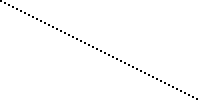
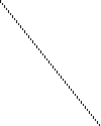

内插技术
========================

本文将介绍一些标准的视频帧插值技术，特别是概述了SVP/MVtools（也称为基于运动的插值）等技术和smoothmotion等算法之间的区别。您还可以在[该资源库](https://github.com/haasn/interpolation-samples)中找到一组专门用于复制这些算法结果的测试片段，以及一些更多的解释。

为了证明这些差异，我们将看看在60赫兹显示器上显示一个24赫兹的视频文件时会发生什么。这就是我将使用的源文件。为了说明问题，每个视频帧将显示为图像的一条水平线。(所以纵轴是时间轴）。

我们现在将讨论将其转换为60赫兹视频流的不同技术（例如，适合在60赫兹显示器上显示）。因此，纵轴将从100像素重新缩放到250像素。(60/24 = 2.5)

3:2下拉
============

传统的技术，包括默认的mpv行为，是简单地保持每个源帧，直到下一帧的相应时间戳过去。由于这个例子中的特殊比例（60/24 = 2.5），这意味着第一帧将被显示3次，第二帧2次，第三帧3次，第四帧2次，以此类推。这个模式看起来像这样。

    A A A B B C C C D D E E E F F

可以清楚地看到，不一致的宽度导致了锯齿状的外观，这就是所谓的抖动现象的可视化。

这种技术本质上就像最近的邻居升格--每一帧都简单地选择原始视频源中与之最接近的源帧（向下取整）。

基于运动的插值
==========================

基于运动的插值算法，如SVP、MVTools或各种电视设备内置的芯片，采用复杂的算法，试图识别视频中的运动（运动向量），并根据需要填补缺失的空白。

这极大地改变了结果--它现在是一个连续的运动，类似于真正的60赫兹剪辑。然而，这是有代价的--不仅所涉及的数学计算非常昂贵，而且算法也不完美，经常导致人工制品（变形的图像、波浪线等）。

此外，这也是所谓的肥皂剧效应的来源，这只是指60赫兹的运动看起来像什么。这个名字是基于这样一个事实：像肥皂剧这样的廉价电视节目通常是以隔行扫描的60赫兹拍摄的，而不是大多数电影内容使用的（更昂贵的）电影格式，后者通常是以24赫兹拍摄的。因此，许多人下意识地
将60赫兹内容的视觉外观与肥皂剧联系起来，因此认为它看起来更糟糕。

这本质上类似于“智能”放大过滤器，例如NEDI或NNEDI3--它们的计算成本也很高，产生的结果会极大地改变源图像。

Smoothmotion
============

Smoothmotion的方法是将每一帧精确地显示2.5次，其中我们通过将两个相邻的帧混合在一起显示0.5次。就模式而言，它的结果是这样的。

    A A A+B B B C C C+D D D E E E+F F F

这里，A+B指的是一帧正好是A和B的一半，混合在一起。总的结果是，每一帧显示的时间一致，从而使运动流畅。

正如你所看到的，由于帧高的规律性增加，整体外观更加平滑，而整体感知的帧率（24赫兹）并没有受到影响--线条仍然清晰分明。

这不仅容易计算（没有任何基于运动的预测，只是两个帧的简单混合操作），而且还保留了原始片段的感知帧率，所以没有肥皂剧效应或类似的情况。

从本质上讲，smoothmotion就像使用最邻近算法调整大小，但对结果进行过采样（类似于视频游戏中的多重采样以减少混叠）。由于这个原因，它在mpv的实现中被称为 "oversample"。

基于卷积的插值
===============================

这种操作模式是基于将视频片段的时间维度视为另一个静态维度的想法，与分辨率相同--本质上，我们将输入视为大小为Width×Height×Duration的大型3D信号，使用信号理论中的标准技术重建这一输入。基本上，我们不是用源图像中的离散像素对内核进行卷积，而是用离散帧中的相同像素对内核进行卷积。

与smoothmotion的主要区别在于，它基本上是对时间轴进行低通处理，以确保没有高频失真被添加进来（这在smoothmotion算法中看起来可能是不规则的），而且它可以重建一些 "中间 "像素值，这对慢动作尤其有效，但在某些情况下会增加额外的运动模糊度。

正如你所看到的，整体外观看起来与smoothmotion相似，但不是在尖锐和混合之间的帧过渡，而是每一帧总是被混合到下一帧。

还有一种理论上合理的操作模式被称为"Sphinx"，它基于同时插值所有三个维度，使用一个精心构造的滤波器，该滤波器具有完美的球形频率响应，据推测它能更好地保留对角线上的频率（例如，运动中的静态图像）。命名是基于Sinc和Jinc的延续，Sphinx代表球体，作为其他的三维类似物，它们分别代表一维和二维。虽然在 https://github.com/haasn/mpv/commit/7d10c9b76f39bfd2fe606b8702b39888d117c685 以满足好奇心，但它不会进入主程序，因为它太慢了，而且没有明显的好处，同时在半径为3或以上的地方振铃太强。(如果有的话，它必须与某种时间性的抗振铃算法一起使用。）
