# mpv播放器的使用引导

_ver.20220318_


- 极短的介绍

mpv是极简设计的高画质的开源播放器。  
与传统的PC高画质方案Directshow+（mpc+lavfilter+madvr+xysubfilter）不同，mpv是一整套的解决方案（单播放器解码渲染字幕齐活）（VLC的既视感？？？）。用户的不同用法决定了这个方案可以十分省事，也可以非常折腾。


- ...

本文的假定使用环境 win11-x64 Intel-CPU Nvidia-GPU  
本教程独立，不从属于懒人包的文档，基于shinchiro编译并打包发布的版本撰写。

推荐使用的高级文本编辑器，完全可替代系统自带的记事本 [Notepad3](https://www.rizonesoft.com/downloads/notepad3/)


## mpv 播放器的使用【入门】

> 既是入门，也是最省心的用法。


### 1.下载安装

mpv目前没有官方编译的版本，第三方shinchiro编译的算公认的半官方版，在 [SOURCEGORGE](https://sourceforge.net/projects/mpv-player-windows/files/64bit/) 或 [他的仓库](https://github.com/shinchiro/mpv-winbuild-cmake/releases) 获取64位最新版本：    
全部解压至自定义目录，点击运行 **mpv.exe** ，拖入任意视频播放以快速测试兼容性。

如果需要注册成可选的默认播放器，以管理员权限运行 <font color=green>**installer**</font> 文件夹内的 **mpv-install.bat** ，此后不要更改 **mpv.exe** 所在文件夹的路径或名称，否则需要重新执行该文件重新注册到系统。

🔺 出于兼容考虑，安置的路径里不要存在中文，最好为纯英文数字  
出于将来省事可能性的考虑（见下章 **【进阶】** ），mpv尽可能放在盘符根目录


### 2.更改权限（可选：视安置路径而定）

进入后方的步骤前，先确保 **mpv.exe** 所在路径（及子文件夹）具有被完全读写的权限。  
_放在C盘目录的通常需要这一步_  
`（文件夹右键）属性 → 安全 → 编辑 → 选择需要被授权的用户 → ☑允许`  
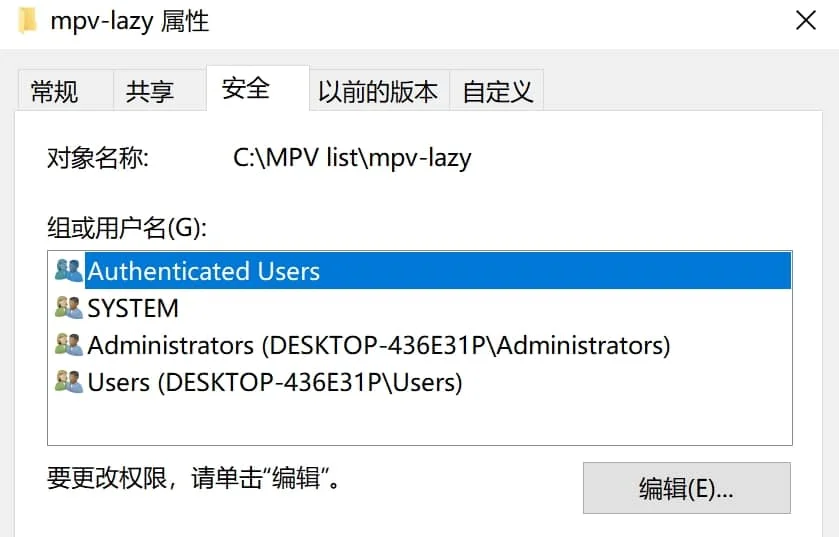 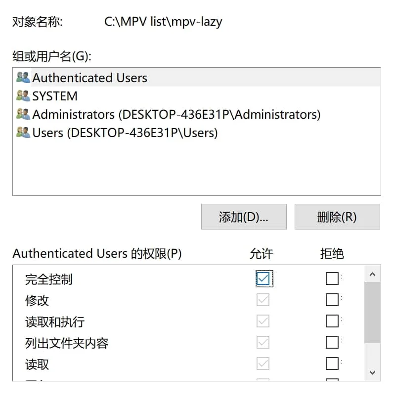


### 3.选项设置

因为mpv本身不具有图形化前端，绝大多数的设置选项都是靠在**主设置文件** <font color=blue>**mpv.conf**</font> 中输入参数实现的。

mpv的默认设置目录为 <font color=green>**C:/Users/你的用户名/AppData/Roaming/mpv/**</font>  
强烈建议你在 **mpv.exe** 的旁边新建一个 <font color=green>**portable_config**</font> 的文件夹，该目录具有最高级的优先级，一旦存在此文件夹，其它所有的设置目录都会被忽略。  
因此在 <font color=green>**/portable_config/**</font> 内新建一个 <font color=blue>**mpv.conf**</font> 的空文本，先确保文本编码为 `UTF-8`  
即 <font color=green>**X:/xxxxx/你的MPV文件夹/portable_config/mpv.conf**</font>  
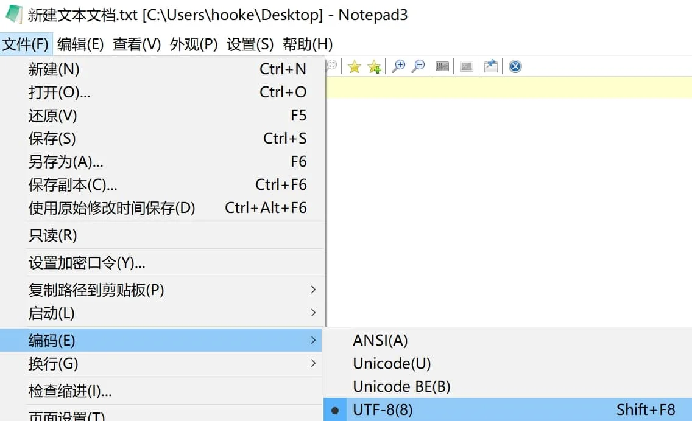

这两种**设置目录**的选择各有特点：
- 以 <font color=green>**C:/Users/你的用户名/AppData/Roaming/mpv/**</font> 为设置目录，相当于这是“全局设置目录”，不管你使用电脑里存放的多少个不同版本的mpv，都会自动读取这个设置目录
- 以 <font color=green>**X:/xxxxx/你的MPV文件夹/portable_config/**</font> 为设置目录，除去其具有最高优先级（会让其忽略“全局设置”）的特性，还赋予了软件绿色化的特性（查看 **【进阶】** 章可知大部分文件都可放在设置目录），非常适合便携党。


在 <font color=blue>**mpv.conf**</font> 中输入以下必要参数：

```ini
 hwdec=d3d11va                           # 使用d3d11va硬解（原生模式）
 hwdec-codecs=all                        # 尽可能所有格式先尝试硬解
#log-file="~~desktop/mpv.log"            # 输出log日志在桌面
 keep-open=yes                           # 播放完毕后不自动退出
 save-position-on-quit=yes               # 退出时保存当前播放状态
 audio-file-auto=fuzzy                   # 自动加载同名外置音轨
#icc-profile-auto                        # 应用系统icc文件进行色彩修正
 icc-cache-dir="~~/icc_cache"            # 存储icc缓存以加速二次启动
#profile=gpu-hq                          # 使用内置的预设的较高画质方案
 gpu-shader-cache-dir="~~/shaders_cache" # 存储着色器缓存以加速二次启动
 sub-auto=fuzzy                          # 自动加载同名外置字幕
 screenshot-directory="~~desktop/"       # 截图的输出路径在桌面
```

辅助理解：  
如何理解这样写的目的，某一行参数中如果有注释符号"**#**"，意味着该行 `#` 所在位置以后的内容为无效。  
如果将这一行一行参数看作一个一个可以打勾的选项。则 `hwdec=d3d11va` 类似于 "☑使用d3d11va硬解" 激活该参数，反之 `#hwdec=d3d11va` 对应 "☐使用d3d11va硬解" 未勾选该选项（使用默认值）。

部分被注释掉的参数：  
  `--log-file` 用于输出日志查错，一般人用不到也看不懂  
  `--icc-profile-auto` 对于已经校色的用户应当开启，未校色的用户开启会产生色彩错误  
  `--profile=gpu-hq` 如果你的显卡不太差，可以使用这个内建的方案

🔺 由于主设置文件的书写规范最为宽松：  
===你可以在参数后直接注释中文解释 `hwdec=d3d11va # 使用d3d11va硬解（原生模式）` ；  
===也可以加大量空格美化参数的排版 `hwdec  =  d3d11va  #  使用d3d11va硬解（原生模式）` ；  
===还可以用 `--hwdec=d3d11va` 这种（不合规的）替代写法表示激活的参数；  
===甚至其中 `no-osd-bar` 这类no-开头的参数可改成为 `osd-bar=no`；  
===以及官方手册中没有赋值的参数比如 `deband` 可以写成 `deband=yes` （等效）。


### 4.高频快捷键

上方必要参数输入完保存退出。再记住常用快捷键和界面控件作用：  
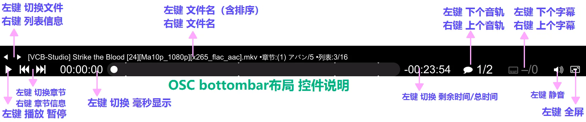  
`1`  `2` 调整对比度  
`3`  `4` 调整亮度  
`5`  `6` 调整伽玛  
`7`  `8` 调整饱和度  
`9`  `0` 调整音量  
`[`  `]` 调整播放速度  
`Backspace` 重置播放速度  
`s` 快速截屏  
`i` 显示有关当前播放文件的统计信息  
还有其它的 [常用快捷键](https://mpv.io/manual/master/#interactive-control)


<font color=purple>入门教程到此结束。</font>


## mpv 播放器的使用【进阶】

> 开始本章前，默认已读完入门章。无尽折腾之路，由此开启。


### 1.主设置文件细化

最可靠的途径是直接看官方的最新手册： [manual](https://mpv.io/manual/master/)  
为了降低难度和节省时间，我挑选了其中的一些参数并添加了 [中文注释](https://github.com/hooke007/MPV_lazy/blob/main/portable_config/mpv.conf)  
由于涉及的文本量巨大，此处不赘述重复的内容。从自身偏好出发，个性化平衡适配你的需求和硬件。


### 2.快捷键自定义

使用 <font color=blue>**input.conf**</font> 文件创建属于你自己的快捷键方案，该文件应和**主设置文件** <font color=blue>**mpv.conf**</font> 位于同一级目录

查看 [官方的内建方案](https://github.com/mpv-player/mpv/blob/master/etc/input.conf) 获得全部快捷键对应的功能；  
同样我的 [懒人包版的中文注释](https://github.com/hooke007/MPV_lazy/blob/main/portable_config/input.conf) 也能降低上手难度。

即使你的 <font color=blue>**input.conf**</font> 文件不存在设置目录里（或为空文本），mpv依旧会使用内建的方案。

🔺 和主设置文件一样，input的书写规范也很宽松，参考我的中文注释版，你可以尽情美化排版便于阅读。  
===你可以直接在 <font color=blue>**mpv.conf**</font> 内使用 `--no-input-default-bindings` 参数完全屏蔽内建的方案，从而省去逐个参数 `ignore` 依次屏蔽各个按键的步骤。  
===（注意该参数同样会屏蔽外部脚本的初始快捷键方案，如果你不想外部脚本受影响，那么就使用另一个参数 `--no-input-builtin-bindings` ）


#### 2.1.运行时更改设置

这里以 `set` `cycle` 和 `cycle-values` 这三个命令快速举例。例如在 <font color=blue>**input.conf**</font> 中写入：

```
ESC        set fullscreen no                              # 退出全屏状态
f          cycle fullscreen                               # 循环切换全屏的状态（同内建方案）
Ctrl+LEFT  cycle-values video-rotate "0" "270" "180" "90" # 视频输出逆时针旋转90°
Ctrl+RIGHT cycle-values video-rotate "0" "90" "180" "270" # ~~~~~~~~逆~~~~~~~~~~~
```

可保存后进行测试，观察结果是否符合预期。

`set` 的功能相当于 `=` ，用于指定选项/属性修改到你设定的目标；  
`cycle` 通常用于只有 `yes` 或 `no` 两个状态的参数； `cycle-values` 可用于在指定的多个值从左往右切换。  
上方示例利用这个特性，成功实现了无脚本依赖的360°旋转操作。

注意事项、完整功能与更多示例参考 [手册[05]](https://hooke007.github.io/mpv-lazy/[05]_%E5%BF%AB%E6%8D%B7%E9%94%AE%E8%87%AA%E5%AE%9A%E4%B9%89.html)


### 3.脚本增强（LUA）

_JS脚本也受支持，但本文暂时不记录，用法大体相似_

mpv中的很多功能都是依赖LUA脚本的，比如 i 键显示的统计信息使用的内置脚本 **stats.lua** ，你使用的简易控制界面是 **osc.lua** 。  
脚本的部分功能可由主设置文件控制，比如 `--no-osc` 。但是绝大多数功能依旧是由各自的设置文件控制。  
因此在 `mpv.conf` 的所在位置新建 `script-opts` 文件夹，这里面将放置所有脚本的设置文件，mpv会自动读取。  
脚本的对应设置文件名为 <font color=green>**同脚本名.conf**</font>

🔺 此处开始往后，应该注释掉这个参数 `--save-position-on-quit=yes`  
===目前为止，这个参数除了保存了播放进度外，还储存了许多 [额外的状态](https://github.com/mpv-player/mpv/issues/4641) ，个人偏好不使用；  
===如果你希望保留**退出时记录播放进度**的功能，可以不禁用该功能，同时用另一个参数 `watch-later-options=vid,aid,sid` 限制其额外记录的属性（示例对应的是：视频轨、音轨、字幕轨序号）


#### 3.1内置脚本

内置脚本由于已集成，直接创建/编辑对应的设置文件即可，你可以在 [此处](https://github.com/mpv-player/mpv/tree/master/player/lua) 查看内置脚本的更新历史。

以我的推荐用法为例，在 <font color=green>**X:/xxxxx/你的MPV文件夹/portable_config/script-opts/**</font> 里放置 `xxxx.conf` 的脚本设置文件  
你依然可以在 [我的仓库](https://github.com/hooke007/MPV_lazy/tree/main/portable_config/script-opts) 里参考：  
其中 `console.conf` `osc.conf` `stats.conf` 都是内置脚本的设置文件

🔺 此后为了避免识别问题，严格文本规范：  
===应该直接写 `xxx=yyy` **不要加多余的空格**，**如需注释务必单独另起一行**。  
===文本编码依旧 <font color=red>UTF-8</font> ，额外的须要换行为 <font color=red>Unix(LR)</font>

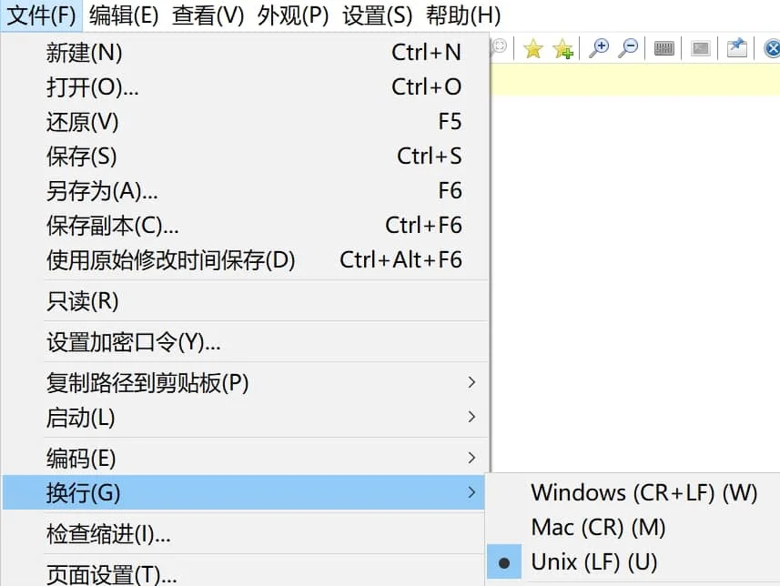


##### 3.1.1.控制台

mpv集成的 **console.lua** 脚本带来了控制台功能，一般用于便于快速查错/临时变更属性或选项。  
官方手册 [定位](https://mpv.io/manual/master/#console)  
打开播放器后，按快捷键 ` 唤起控制台查看控制台信息，此时再按 Esc 关闭控制台。  

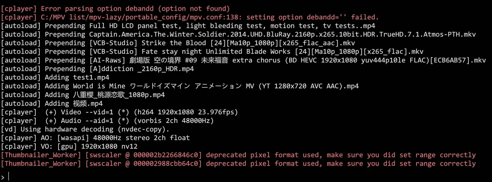

控制台指令的语法同上文快捷键的语法，例如输入 `set fullscreen yes` 回车即执行“进入全屏”。


##### 3.1.2.数据统计

mpv集成的 **stats.lua** 脚本带来了类似 Mediainfo 的功能，可用于查看各项状态信息。  
官方手册 [定位](https://mpv.io/manual/master/#stats)


##### 3.1.3.条件配置

mpv集成的 **auto_profiles.lua** 脚本带来了根据条件自动切换设置的功能。  
参考 [mpv-lazy系列手册02](https://hooke007.github.io/mpv-lazy/[02]_%E9%85%8D%E7%BD%AE%E7%BB%84%E4%B8%8E%E5%8F%A6%E7%B1%BB%E5%86%99%E6%B3%95%E7%A4%BA%E4%BE%8B.html)  
官方手册 [定位](https://mpv.io/manual/master/#conditional-auto-profiles)


##### 3.1.4.YTDL

mpv集成的 **ytdl_hook.lua** 脚本加强了网络串流的播放能力。  
需要 **mpv.exe** 所在目录存在 **youtube-dl.exe** [官方发布地址](https://github.com/ytdl-org/youtube-dl/releases)  
官方手册 [定位](https://mpv.io/manual/master/#options-ytdl)

该脚本兼容ytdl的热门分支yt-dlp  
需要 **mpv.exe** 所在目录存在 **yt-dlp.exe** [官方发布地址](https://github.com/yt-dlp/yt-dlp/releases)

如何指定使用的程序可参考 [此处](https://github.com/hooke007/MPV_lazy/blob/main/portable_config/script-opts/ytdl_hook.conf)  
（注意mpv0.34.0及之后的版本默认优先使用yt-dlp）


#### 3.2.外置脚本

同样在**主设置文件**的目录，建立一个叫 <font color=green>**scripts**</font> 文件夹，默认情况下，mpv会自动读取该文件夹内的脚本。  
你可以在 [此处](https://github.com/mpv-player/mpv/wiki/User-Scripts#lua-scripts) 查看公开的第三方外置脚本（包含许多过时的脚本）

以我的推荐用法为例，下载你所需要的脚本， `xxx.lua` 放置在 <font color=green>**X:/xxxxx/你的MPV文件夹/portable_config/scripts/**</font> 内  
对应的设置文件 `xxx.conf` 放置在 <font color=green>**X:/xxxxx/你的MPV文件夹/portable_config/script-opts/**</font> 里  
具体参数遵循你所使用的脚本的作者说明。同上，你依然可以参考我仓库内的示例。

示范：  
===这里以许多人都会用的一个脚本 "**autoload.lua**" （自动导入同目录所有文件到播放列表）为例  
===对应的设置文件： https://github.com/hooke007/MPV_lazy/blob/main/portable_config/script-opts/autoload.conf  
===分别下载两个文件或手动复制源码（注意文本规范）创建到指定位置。  
===在含有多个视频文件的目录随意打开某个视频，按 F8 查看播放列表，预期情况是已正确载入所有视频文件。

🔺 此处为了避免识别问题，严格文本规范：内容同上。  
🔺 一种略罕见的脚本的包装形式表现为多个文件群组。它的文件结构为：必有一个名为 **main.lua** 的脚本文件位于某个文件夹中，且同路径下附带有多个其它文件（不限lua）。它的使用方法与单文件的lua脚本略不同，你至少需要把整个文件夹塞进 <font color=green>**scripts**</font> 目录中（绝对不能直接把 **main.lua** 放在此处），其它进一步的安装步骤遵作者本人的使用说明。


### 4.插入滤镜

官方手册定位：  
[音频滤镜](https://mpv.io/manual/master/#audio-filters)  
[视频滤镜](https://mpv.io/manual/master/#video-filters)

🔺 此处往后，为了避免原生硬解模式不支持，在主设置文件中应使用 `hwdec=d3d11va-copy` 或 `hwdec=no`  
_`dxva2-copy` 不见得一定比 `d3d11va-copy` 实际性能表现差，根据你的实际情况选择。高端N卡用户应高优先使用 `nvdec-copy`_


#### 4.1.常规用法

这里导入实例讲解：  
===如果你使用 `--icc-profile-auto` 这个参数对视频进行了3dlut色彩映射操作，你可能会发觉mpv的视频色彩偏亮（如果你使用madvr的3dlut对比过）。  
===根本原因在于mpv遵循的是BT.1886曲线，因此，你需要在 <font color=blue>**mpv.conf**</font> 中使用如下参数进行GAMMA修正以符合标准SRGB。

```ini
vf-append=format=gamma=gamma2.2
```

vf参数的标准写法为 `vf=xxxxx` ，但是mpv只能存在一条这样的参数，尽管你可以使用下方参数设置初始一起插入多个滤镜。

```ini
vf=滤镜①=参数❶=值:参数❷=值,滤镜②...   # 不同滤镜间用","隔开；同一滤镜的不同参数间用":"隔开
```

但是为了避免运行时被覆盖，使用 `-append` 后缀，意为追加视频滤镜。可以存在多个 `vf-append` 且不影响 `vf=xxxxx` 指定的滤镜

🔺 此处往后，带 `-append` `-del` 之类后缀的参数只能一条带一个滤镜/着色器


#### 4.2.运行时启用

除了在主设置文件中定好规则，还可以灵活的通过 <font color=blue>**input.conf**</font> 的快捷键方案在运行时激活/关闭。导入例子：  
在 <font color=blue>**input.conf**</font> 中写入以下参数

```
Ctrl+UP  vf toggle vflip
```

结构很容易理解—— “快捷键 参数”，和主设置文件不同的是，后缀 `toggle` 和 `vf` 之间不要用 `-` 进行连接。  
保存后在mpv中播放视频测试，你可以先按下 shift+i 常驻统计信息，观察留意下方。

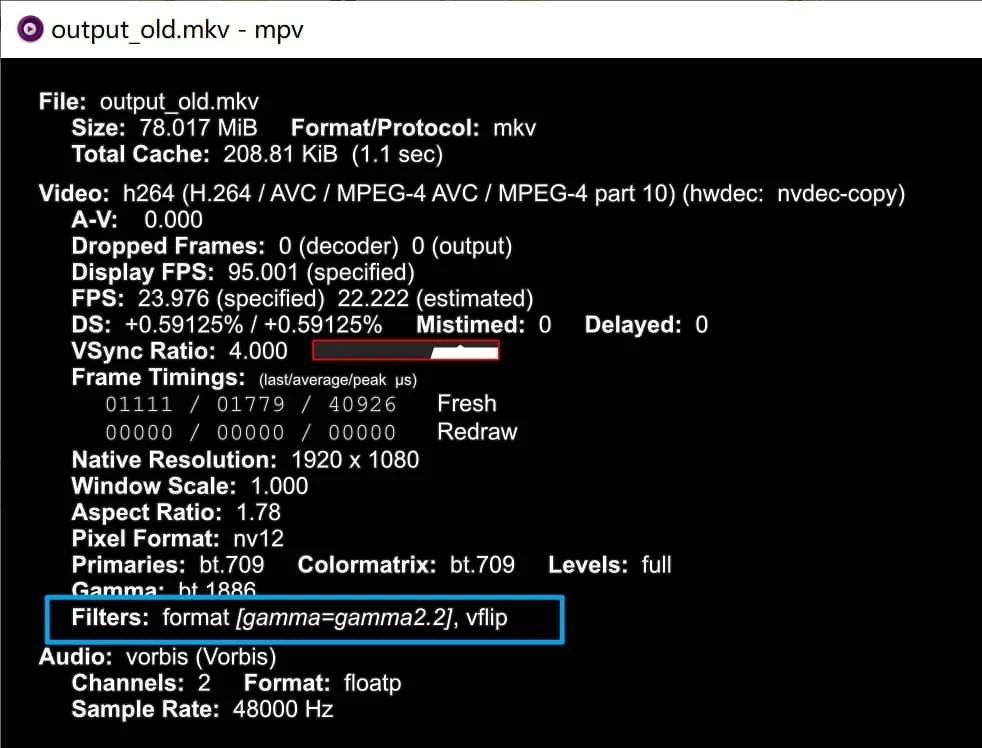

第一次按下 Ctrl+↑ 将插入垂直翻转滤镜，第二次按下将撤销该滤镜。

滤镜类的全部 [可用后缀](https://mpv.io/manual/master/#filter-options) 。

🔺 关于该部分内容，重写的 [手册[03]](https://hooke007.github.io/mpv-lazy/[03]_%E8%A7%86%E9%A2%91%E6%BB%A4%E9%95%9C.html) 中记录的更具体和完善。


### 5.第三方着色器

你可以在此处获取一些公开的第三方着色器： https://github.com/mpv-player/mpv/wiki/User-Scripts#user-shaders  
下载的着色器文件扩展名通常为 **.glsl** 或 **.hook** ，mpv并没有规定这些文件的默认加载路径。  
如果你有很多着色器的使用需求，我建议你在主设置文件路径下建立一个 <font color=green>**shaders**</font> 文件夹放置所有第三方着色器。  
以我的推荐用法为例，下载你想要的着色器， `xxx.glsl` 放置在 <font color=green>**X:/xxxxx/你的MPV文件夹/portable_config/shaders/**</font> 内


#### 5.1.常规用法

在主设置文件中，使用参数 `glsl-shaders=<file-list>` 设置初始加载的多个着色器。  
同样为了避免运行时被覆盖，使用 `-append` 后缀，意为追加着色器。可以存在多个 `glsl-shaders-append` 且不影响 `glsl-shaders=` 指定的滤镜。  
注意**不要混淆**，近似参数 `glsl-shader=<file>` 等效 `glsl-shaders-append`

加载着色器的路径写法，官方手册 [定位](https://mpv.io/manual/master/#paths)  
可以使用绝对路径，比如：

```ini
glsl-shaders-append="X:/xxxxx/你的MPV文件夹/portable_config/shaders/xxx.glsl"
```

也可以使用相对路径节省字数，比如：

```ini
glsl-shaders-append="~~/shaders/xxx.glsl"
```

🔺 其中 `~~/` 等效 `~~home/` ，指代的是 设置目录**（高优先级）**  
===使用 `glsl-shaders=` 加载多个着色器时用 `;` 分隔  
===尽量避免windows的路径下 `/` 和 `\` 的混用，统一使用 `/` 避免可能的错误


#### 5.2.运行时启用

可参考上方滤镜部分。导入例子：  
在 [此处](https://gist.github.com/igv/8a77e4eb8276753b54bb94c1c50c317e) 下载 **adaptive-sharpen.glsl**  
放置在推荐位置，在 <font color=blue>**input.conf**</font> 中写入

```
CTRL+1 change-list glsl-shaders toggle "~~/shaders/adaptive-sharpen.glsl"
```

保存后在mpv中播放视频测试，你可以先按下 "shift+i" 常驻统计信息，再按 "2" 翻到第二页，观察留意着色器列表。

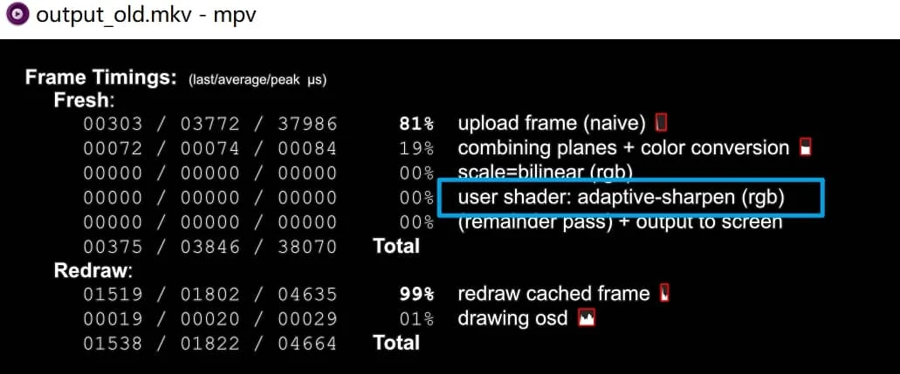

第一次按下 "Ctrl+↑" 将出现 `user shader: ...` ，第二次按下将撤销。

着色器类的 [可用后缀](https://mpv.io/manual/master/#string-list-and-path-list-options) 。


#### 5.3.第三方着色器介绍

参考 [mpv-lazy系列手册[01]](https://hooke007.github.io/mpv-lazy/[01]_%E7%AC%AC%E4%B8%89%E6%96%B9%E7%9D%80%E8%89%B2%E5%99%A8%E4%BB%8B%E7%BB%8D.html)


### 6.VapourSynth

VS是开源的非线性处理的视频帧服务插件，使用Python作为脚本语言，mpv支持VS以滤镜形式插入到视频播放流程中。  
mpv未集成该部分，需要手动安装（以下步骤出于绿色化考虑，使用便携包而不是安装版程序）。


#### 6.1.部署前置

在 [此处](https://www.python.org/downloads/) 获取Python，选择64位便携包下载：

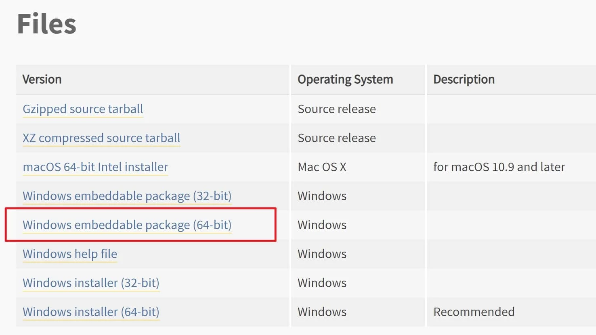

在 [此处](https://github.com/vapoursynth/vapoursynth/releases) 获取VapourSyhth，选择64位便携包下载：

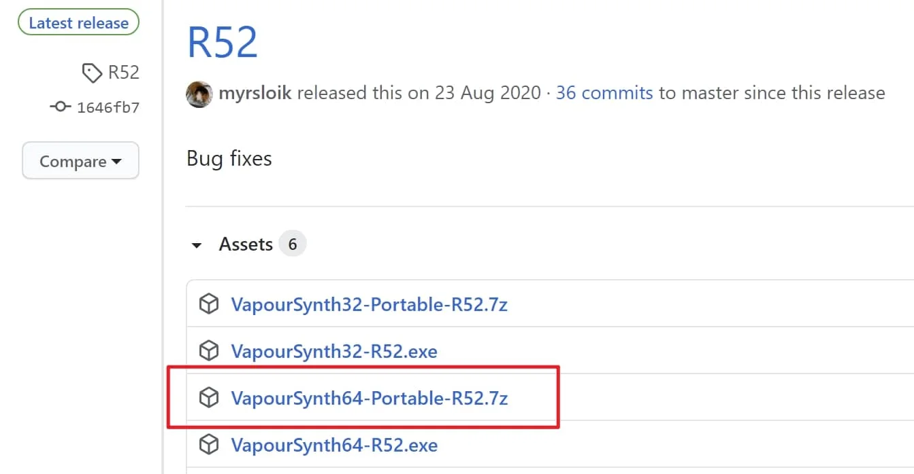

解压两个压缩包的全部文件到 **mpv.exe** 所在路径

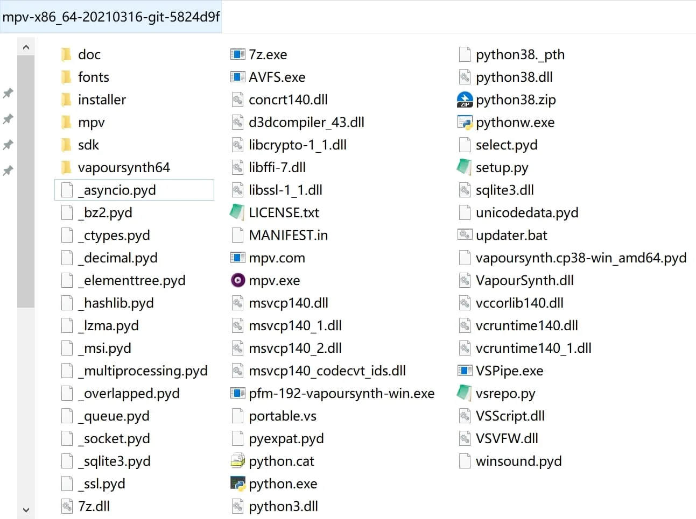

🔺 官方的VapourSyhth版本号很依赖Python，因此需要使用匹配的Python版本才能正常工作，例如 R53-R57 对应 3.8.x-3.9.x


#### 6.2.mvtools 补帧法

你可以在 [此处](https://github.com/mpv-player/mpv/wiki/User-Scripts#vapoursynth-scripts) 获取公开的VS脚本  
VS滤镜参与mpv的播放流程至少需要三个部分： ***dll库 + 对应的vpy脚本 + mpv/input.conf中触发条件的参数***


##### 6.2.1.库的下载

“使用mvtools对视频进行补帧”作为较常见的一种用法，此处将它作为示例：  
获取mvtools所需的 [库](https://github.com/dubhater/vapoursynth-mvtools/releases)

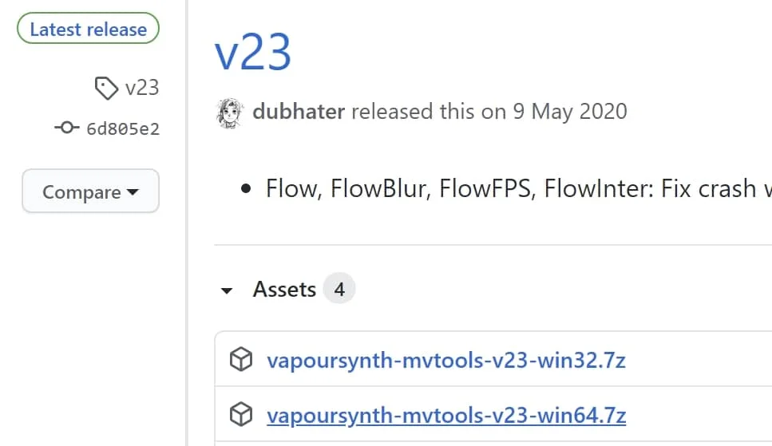

解压放置 **libmvtools.dll** 在 <font color=green>**X:/xxxxx/你的MPV文件夹/vapoursynth64/plugins/**</font> 内


##### 6.2.2.脚本安置

获取对应的vpy脚本，无所谓扩展名是 `.py` 或者 `.vpy` ，脚本也无命名要求规范

[这里](https://gist.github.com/KCCat/1b3a7b7f085a066af3719859f88ded02) 是KCCat大佬的版本  
或者选择我在懒人包 [使用的版本](https://github.com/hooke007/MPV_lazy/blob/main/portable_config/mvtools-fast.vpy)

放置位置也随意，按照前文的推荐放在 <font color=green>**X:/xxxxx/你的MPV文件夹/portable_config/**</font> 内便于调用


##### 6.2.3.设置调用

一种方法是**主设置文件** <font color=blue>**mpv.conf**</font> 中使用伴随mpv启动时激活

```ini
vf-append=vapoursynth="~~/xxxxx.vpy"
```

另一种是 <font color=blue>**input.conf**</font> 中使用如下的示例，灵活开启关闭

```
CTRL+v vf toggle vapoursynth="~~/xxxxx.vpy"
```

因为是以滤镜形式参与播放流程，所以可参考上文 **插入滤镜** 部分，此处不再赘述。  
VS工作状态的检验可多方结合，例如在统计信息中的滤镜列表、控制台有无报错信息、实际画面有无符合预期的变化。


## FAQ 常见问题解答

- **选择稳定版还是开发版？**

对mpv这个项目而言并不存在真正的稳定版，它的很多功能由其它依赖提供，即便是shinchiro发布的稳定版编译时也是用的开发版的第三方依赖；所谓的stable版本（release）只是开发者不定期拿过去的某一版git做的标记（主要是便于某些Linux发行版的仓库更新）。

- **本文涵盖了所有常见功能的介绍？**

并不是，比如我没提“JS脚本的使用”，我只挑选了自认为多数人的中高频需求进行说明。

- **太长不想看怎么办？**

有懒人包 [mpv-lazy](https://github.com/hooke007/MPV_lazy) ，虽然我极力想精简它的整合功能的说明，但随着折腾的深入我发现这就是根本不可能的事情，所以你可能到最后还是要看文档。。。

- **mpv-lazy的发布帖收集了萌新常见问题的解决方案？**

大部分都可以无障碍参考 [坛友踩坑录===镜像手册[04]](https://hooke007.github.io/mpv-lazy/[04]_%E5%B8%B8%E8%A7%81FAQ%EF%BC%88%E8%B8%A9%E5%9D%91%E5%BD%95%EF%BC%89.html)

- **mpv的命令行操作的介绍呢？**

不是吧...伪GUI你都不用还用什么命令行啊。[手册[06]](https://hooke007.github.io/mpv-lazy/[06]_%E5%91%BD%E4%BB%A4%E8%A1%8C%E7%95%8C%E9%9D%A2.html)

- **mpv作为跨平台的播放器 是否这个教程适用于LINUX和MAC OS？**

一些脚本需要看是否适配，大部分设置参数适合，但我还是强烈建议详细阅读 [官方手册](https://mpv.io/manual/master/) 。  
_首先你要解决依赖问题，以确保几乎本文记录的所有功能在你的平台上可用_

- **为什么这个播放器如此简jian洁lou？**

因为它没有设计官方的前端（GUI）。

- **有无可用的第三方前端？**

windows:  
[KikoPlay](https://KikoPlayProject.github.io) 支持弹幕，简易库管理  
[mpv.net](https://github.com/stax76/mpv.net) 近乎原生体验，右键提供快捷多功能  
[mpv.net_CM](https://github.com/hooke007/mpv.net_CM) 因为好用于是做了汉化，并依个人需求的定制化成了单独的模组

mac:  
[IINA](https://github.com/iina/iina)

linux:  
很多，但我不熟，而且似乎没必要（
